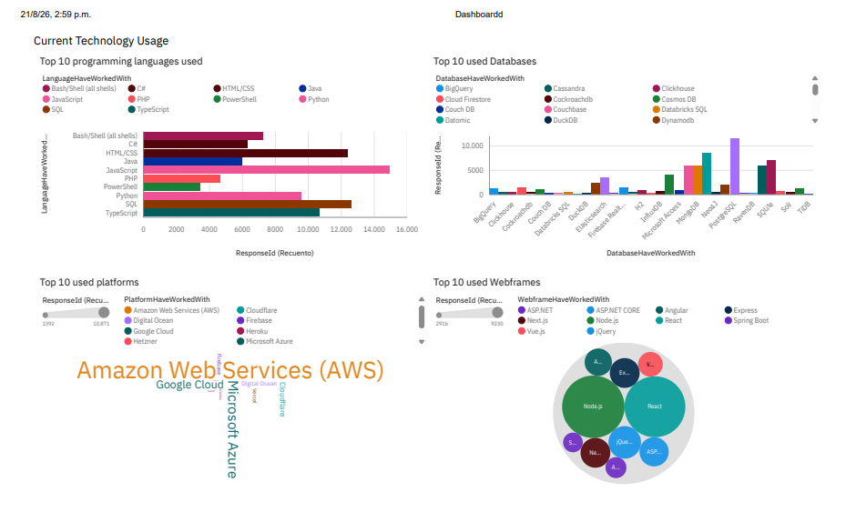

# 📊 Tech Talent & Developer Market Analysis

## 📌 Project Overview & Executive Summary
This project analyzes the global tech ecosystem based on developer survey data and web-scraped job posting insights. The goal is to identify current technology adoption, emerging tech trends, compensation benchmarkings, and demographic distributions among software developers worldwide.

* **Project Type:** End-to-End Data Analysis (Data Collection, Cleaning, EDA & Executive Dashboarding)
* **Dataset:** ~18,800 survey responses + API/Web-scraped technology listings.
* **Tools Used:** Python (Pandas, BeautifulSoup, Requests), IBM Cognos Analytics, SQL.

---

## 🎯 Key Business Insights

1. **Current vs. Future Tech Demand:**
   * **Languages:** JavaScript, HTML/CSS, and SQL lead current usage, but **Python** and **TypeScript** show the highest demand for future adoption.
   * **Databases:** PostgreSQL and MySQL remain dominant, with growing developer interest in cloud databases (AWS DynamoDB, Firebase).
2. **Demographics & Workforce:**
   * Over **67%** of surveyed tech professionals fall within the 25–44 age bracket.
   * **Bachelor's degrees** represent the majority of formal education levels among developers (~58%).

---

## 📸 Dashboard Previews (IBM Cognos)

| Current Technology Usage | Future Technology Trends |
| :---: | :---: |
|  |  |

---

## 🛠️ Project Workflow

### 1. Data Acquisition (Web Scraping & APIs)
* Extracted job demand and popular programming language metrics using `BeautifulSoup` and REST API endpoints.

### 2. Data Wrangling & Cleaning (Python / Pandas)
* Identified and removed duplicate entries.
* Standardized categorical variables (e.g., age mapping to numerical equivalents).
* Handled missing values and exported clean datasets for BI modeling.

### 3. Exploratory Data Analysis (EDA) & Visualization
* Developed interactive multi-page executive dashboards using **IBM Cognos Analytics** covering:
  * **Current Tech Stack:** Top 10 languages, platforms, databases, and web frameworks.
  * **Future Tech Trends:** Most desired technologies to learn/adopt.
  * **Demographics:** Geographic distribution, education levels, and age breakdown.

---

## 📂 Repository Structure
